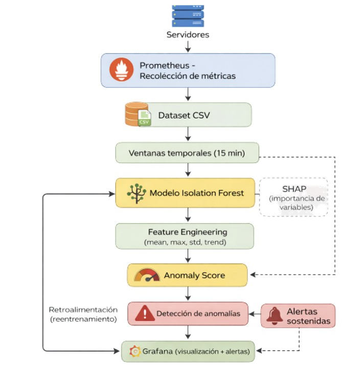
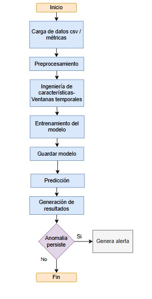

#Versión: v1.0  
#Fecha: Abril 2026
# Modelo de IA para la detección temprana de fallas en servidores

## Descripción

En entornos de infraestructura tecnológica, el monitoreo tradicional basado en umbrales fijos presenta limitaciones para detectar anomalías de forma oportuna. Este proyecto propone un modelo de inteligencia artificial basado en Isolation Forest para identificar comportamientos anómalos en métricas de servidores como CPU, memoria y disco.

El objetivo es anticipar fallas antes de que se conviertan en incidentes críticos, mejorando la disponibilidad de los servicios tecnológicos.

## Solución

Se implementa un sistema de detección de anomalías basado en aprendizaje automático no supervisado que:

- Procesa métricas de infraestructura
- Genera variables mediante ventanas temporales
- Detecta anomalías usando Isolation Forest
- Genera alertas basadas en anomalías sostenidas (2 horas)

## Arquitectura del sistema



## Flujo del sistema



El flujo describe el proceso completo desde la carga de datos hasta la generación de alertas, incluyendo la validación de anomalías persistentes para reducir falsos positivos.

## Estructura del proyecto
                                    Proyecto-MIA/
                                   │
                                   ├── data/
                                   │   ├── raw/
                                   │   ├── processed/
                                   │   └── sample/
                                   │
                                   │ ── notebooks/
                                   ├── scripts/
                                   │   ├── train.py
                                   │   ├── predict.py
                                   │   ├── alerts.py
                                   │   ├── preprocess.py
                                   │   ├── features.py
                                   │
                                   ├── models/
                                   ├── results/
                                   ├── docs/
                                   ├── tests/

## Instalación

```bash
git clone https://github.com/valetefa9594-lgtm/Proyecto-MIA.git
cd Proyecto-MIA
pip install -r requerimientos.txt

## Ejecución

Entrenamiento del modelo:
python scripts/train.py

##Prediccion
python scripts/predict.py

##Generacion de alertas
python scripts/alerts.py


## RESULTADOS
```markdown
## Resultados
El modelo fue evaluado en un entorno controlado obteniendo:
- ROC-AUC: 0.8173
- KS: 0.6548
Estas métricas evidencian una adecuada capacidad de discriminación entre comportamientos normales y anómalos.

## Evaluación del modelo

Las métricas fueron calculadas en un entorno de experimentación (Google Colab):

- 📄 [Evaluación en PDF](docs/Proyecto Capstone Collab.pdf)

## Tecnologías utilizadas

- Python
- scikit-learn
- Pandas
- Prometheus
- Grafana
##Pasos para ejecutar:

1. Instalar dependencias: pip install -r requirements.txt
2. Ejecutar entrenamiento: python train.py
3. Ejecutar predicción: python predict.py
4. Revisar resultados en carpeta /results

Resultado esperado:
Se generará un archivo con anomaly_score y alertas detectadas.


## Autores
Valeria Masache
Santiago Guachamin  
Maestría en Inteligencia Artificial Aplicada

